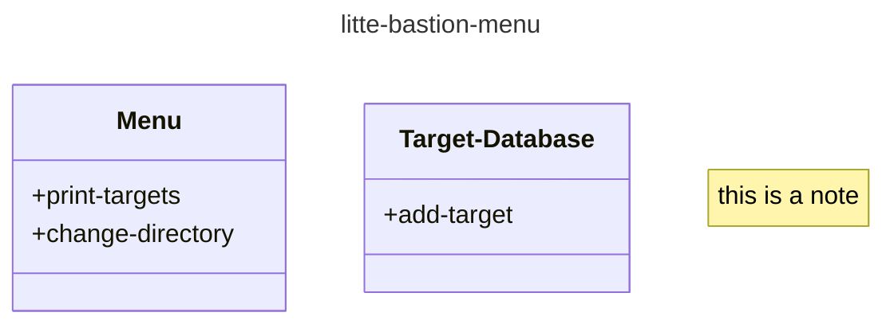

```mermaid
---
title: litte-bastion-menu
---
classDiagram
    note "this is a note"

    class Menu{
        +print-targets
        +change-directory
    }
    class Target-Database{
        +add-target
    }
```